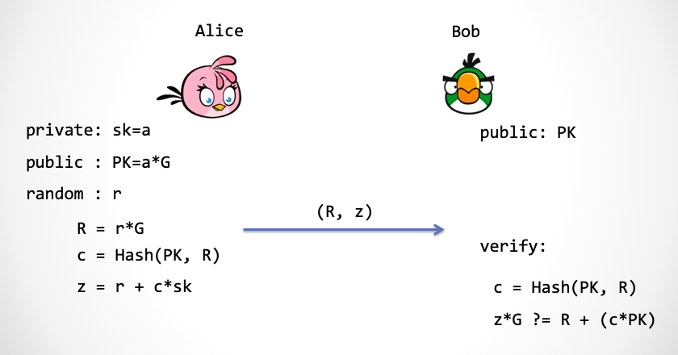
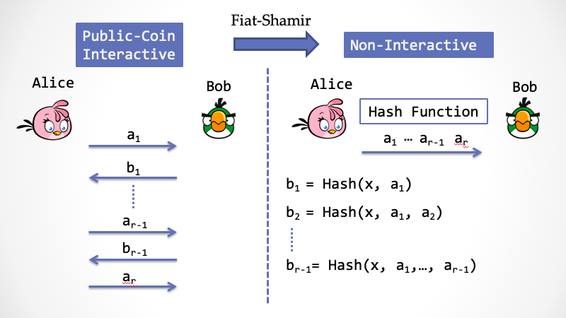

# ZK 残酷共学第 1 期残酷指引

> ⚠️ 正式开始前请确保你在身体上和精神上都处于合适的状态，请刻意练习，残酷面对 🆒。为方便检索 The First ZK Intensive CoLearning 简写为 ZICL1st，第 2 期即为ZICL2nd，第 3 期即为 ZICL3rd，以此类推。

> ⚠️ 报名需要按要求认真填写下面 [ XXX ] 部分，方可通过报名审核，通过审核即可开始自主学习。

## 共学内容

第一期的重点是向大家介绍什么是 ZK、 ZKP 的基础知识，以及 Circom 代码入门，有一定难度，共学资料如下：

- 第一周：7 月 29 日 - 8 月 4 日：Introduction and History of ZKP
    - 20min 的视频：[初步理解 ZK 是什么](https://www.youtube.com/watch?v=fOGdb1CTu5c)
    - 70min 的播客：[零知识证明：一场”无知“的游戏](https://www.xiaoyuzhoufm.com/episode/6672a76bb6a8412729e0b103)
    - [（一）初识「零知识」与「证明」](https://learn.z2o-k7e.world/zkp-intro/1/zkp-back.html)
    - [（二）理解「模拟」](https://learn.z2o-k7e.world/zkp-intro/2/zkp-simu.html)
    - [（三）寻找「知识」](https://learn.z2o-k7e.world/zkp-intro/3/zkp-pok.html)
    - 100min 的视频：[ZKP Lecture 1: Introduction and History of ZKP](https://www.youtube.com/watch?v=uchjTIlPzFo)
- 第二周：8 月 5 日 - 8 月 11 日：Overview of Modern SNARK Constructions
    - 80min的视频： [ZKP Lecture 2: Overview of Modern SNARK Constructions](https://www.youtube.com/watch?v=bGEXYpt3sj0)
    - [1-Polynomial-Interaction-and-Proof](https://learn.z2o-k7e.world/zk-snarks/1-Polynomial-Interaction-and-Proof.html)
    - [2-Non-interactivity&Distributed-Setup](https://learn.z2o-k7e.world/zk-snarks/2-Non-interactivity&Distributed-Setup.html)
    - [3-General-Purpose-Computation](https://learn.z2o-k7e.world/zk-snarks/3-General-Purpose-Computation.html)
    - [4-Construction-Properties.md](https://learn.z2o-k7e.world/zk-snarks/4-Construction-Properties.html)
    - [5-Pinocchio-Protocol](https://learn.z2o-k7e.world/zk-snarks/5-Pinocchio-Protocol.html)
- 第三周：8 月 12 日 - 8 月 18 日：Write some Circom
    - 基础电路：
        - [ZK Shanghai 基础电路教学](https://www.youtube.com/watch?v=CTJ1JkYLiyw&ab_channel=SutuLabs)
        - 编辑器：[zkREPL](https://zkrepl.dev/)
        - [基础电路练习](https://github.com/wenjin1997/zkshanghai-workshop/blob/main/lecture2-homework.md) 这部分材料结合了Circom源码，可以多花时间来研究
    - 实用电路：
        - [ZK Shanghai 实用电路教学](https://www.youtube.com/watch?v=smJz5RdY0Nc)
        - 课程资源：[snarkjs resources (zkiap.com)](https://zkiap.com/snarkjs)、[What Is Semaphore? | Semaphore](https://docs.semaphore.pse.dev/)

本次共学资料前两周的 lecture 来自 [zk-learning](https://zk-learning.org/)，博客来自 [《探索零知识证明系列》](https://learn.z2o-k7e.world/zkp-intro/toc.html)和[《从零开始学习 zk-SNARK》](https://learn.z2o-k7e.world/zk-snarks/toc.html)，第三周的 Circom 部分来自 [0xparc](https://zkiap.com/)，视频讲解为 [ZK Shanghai](https://zkshanghai.xyz/) 的中文版本。郭宇老师还推荐了这篇文章[《Survey-SNARKs》](https://www.di.ens.fr/~nitulesc/files/Survey-SNARKs.pdf)，学有余力者可以依此找到更多的扩展内容。

### **最后，非常感谢安比实验室郭宇老师对于本次共学资料选择的指导！**

---

# {YuanboXie}
1. 自我介绍: Web3+AI Researcher
2. 你认为你会完成本次残酷学习吗？尽力而为
3. 目前阶段对于 ZK 的了解？有一定ZK基础

## Notes

<!-- Content_START -->

### 2024.07.29

- 学习主题：ZK 基础概念
    - 20min 的视频：[初步理解 ZK 是什么](https://www.youtube.com/watch?v=fOGdb1CTu5c)
    - 70min 的播客：[零知识证明：一场”无知“的游戏](https://www.xiaoyuzhoufm.com/episode/6672a76bb6a8412729e0b103)
- 学习内容小结：在第一个视频里，Amit Sahai 通过和5个不同level背景的人讨论什么是零知识证明，从浅显的概念逐步深入。这里提到了几个关键问题，“知识”，而不是信息或者数据，ZKP协议交互的过程中是有数据/信息交互的，如果完全没有信息是没办法让verifier相信的，但是这里的关键在于用于说服verifier的信息不能泄露关于秘密的任何信息，所以这里强调的知识是不能从prover提供的用于证明的信息获得关于秘密的知识。此外提到了ZKP中的瓶颈主要是prover的proof generation，但是或许这个可以通过和并行计算以及云计算结合来提效。另外这里面还提到ZKP中的根本问题 hardness，一个足够困难的抗量子问题来构建抗量子的ZKP。第二个视频有了更多讨论和举例。

### 2024.07.30

- 学习主题：初识「零知识」与「证明」
    - [（一）初识「零知识」与「证明」](https://learn.z2o-k7e.world/zkp-intro/1/zkp-back.html)
- 学习内容小结：今天学习的内容的关键是【证明】和【知识】。证明凝结了「知识」，但是证明过程却可以不泄露「知识」，同时这个证明验证过程仍然保持了简单、机械，并且有限性。
    - 大白话讲只要我们能写一段程序（一个多项式时间的算法）来判断一个数据是否满足 X 断言，那么这个断言就可以用零知识证明的方式来表达。通俗点讲，只要数据判定是客观的，那么就零知识证明就适用。
    - 如果 Bob 在交互过程中获得的「信息」，可以帮助提升 Bob 直接破解 Alice 秘密的能力，那么我们说 Bob 「获得了知识」。由此可见，知识这个词的定义与 Bob 的计算能力相关，如果信息并不能增加 Bob 的计算能力，那么信息不能被称为「知识」。【获得的能帮助Bob计算出秘密的信息才叫做知识，如果获得的信息对计算Alice的秘密没有帮助则只是信息】。
        - 「知识」是与「计算难度」相关，而「信息」则不是；
        - ~~「知识」是与公共所知的东西有关，而「信息」主要与部分公开的东西有关；~~ 【~~这里不是特别理解,等群佬回复后再补充~~】
    - NP-Complete 是一类问题，他的求解过程是多项式时间内难以完成的，即「求解困难」，但是验证解的过程是多项式时间可以完成的，即「验证简单」。
    - 「电路可满足性问题」+ 「零知识证明」: 所谓的电路可满足性就是指，存在满足电路的一个解。如果这个解的输出值等于一个确定值，那么这个解就能「表示」电路的计算过程。
        - Bob 交给 Alice 一段代码 P，和一个输入 x，让 Alice 来运行一遍，然后把运行结果告诉 Bob。可能这个计算需要消耗资源，而 Bob 把计算过程外包给了 Alice。然后 Alice 运行了一遍，得到了结果 y。然后把 y 告诉 Bob。如何让 Bob 在不运行代码的前提下，相信代码 P 运行的结果一定是 y 呢？
        - 答案是 Bob 把程序 P 转换成一个完全等价的算术电路，然后把电路交给 Alice。Alice 只要计算这个电路就可以了，Alice 只要把参数输入到电路，然后记录下电路在运算过程中，所有与门相连的引脚线上的值。并且最后的电路输出引脚的值等于 y，那么 Bob 就能确信 Alice 确实进行了计算。Alice 需要把电路的所有门的输入与输出写到一张纸上，交给 Bob，这张纸就是一个计算证明。这样 Bob 完全可以在不重复计算电路的情况下来验证这张纸上的证明对不对，验证过程很简单：Bob 依次检查每一个门的输入输出能不能满足一个加法等式或者一个乘法等式。这张纸上的内容就是「满足」算术电路 P 的一个解「Solution」。这样做弊端也很明显（验证工作量+中间过程隐私）。 
        - => 「零知识的电路可满足性证明协议」 Alice 需要以一种零知识的方式，向 Bob 证明她计算过了电路，并且使用了她的秘密输入。
    - 证明过程可能是超乎寻常的复杂，偶尔需要天才横空出世。而验证过程一定（或者应该）是一个非常简单的机械的，在（多项式）有效时间内且能终止的活动。这个不对称性真正体现了证明的意义，展示了零知识证明的价值。

### 2024.07.31
> I know that I know nothing —— 苏格拉底

- 学习主题：理解「模拟」
    - [（二）理解「模拟」](https://learn.z2o-k7e.world/zkp-intro/2/zkp-simu.html)
- 学习内容小结：
    - 安全的定义与不可区分性：「零知识」需要证明，「安全」需要有一个数学意义上的严格定义。
        - 完美安全：假设你是一个攻击者，你通过密文获取不到任何有价值的信息，破解的唯一手段就是靠瞎蒙。【实际上目前达不到】
        - 语义安全：假设你是一个攻击者，你通过密文在多项式时间内计算不出来任何有价值的信息。 =》「不可区分性」
        
    - 模拟器 & 两个世界: 证明的零知识过程，等价于构造（寻找）一个「模拟」算法，这个算法能够让模拟器来模拟出一个「没有知识」的理想世界。如果这个算法存在，而且两个世界不可区分，那么就证明完毕。【即Bob无法判断自己生成的随机数是在真实系统下生成的还是在虚拟机下（被操纵）生成的】

- PS：这个模拟的定义很抽象，感觉还需要再多思考下。
    - UPD: 模拟出的理想世界（比如虚拟机）里，这个理想世界可以时间回溯/快照随机数或者等等(因为世界本身是模拟的，所以随机数本身并不是真随机)，在这种情况下，模拟器可以让我相信他的证明。也就是模拟器在没有知识的情况下让我相信了这个证明。我没办法区分证明所处的环境是否是理想世界还是真实世界（即prover是否有特权），比如verify程序无法判断自己是否处于虚拟机中。但是在没有这种超能力的情况下，prover是没办法让verifier相信的，所以在真实世界的ZKP是soundness的。

### 2024.08.01

- 学习主题：寻找「知识」
    - [（三）寻找「知识」](https://learn.z2o-k7e.world/zkp-intro/3/zkp-pok.html)
- 学习内容小结：
    - 可靠性（Soundness）：Alice 在没有知识的情况下不能通过 Bob 的验证。  => 保护了 Bob 的利益 => 「可靠性」保证了知识的「存在性」。
    - 完备性（Completeness）：Alice 在有知识的情况下可以通过 Bob 的验证。 => 保护了 Alice 的利益
    - 零知识（Zero-knowledge）：Alice 在交互的过程中不会泄露关于知识的任何信息。 => 保护了 Alice 的隐私
        => 「零知识」保证了 验证者 Bob 没有（计算）能力来把和「知识」有关的信息「抽取」出来。不能抽取的「知识」不代表不存在。「可靠性」保证了知识的「存在性」。
        => 只有「知识」在存在的前提下，保证「零知识」才有意义
    - Schnorr 协议(代表了一大类的安全协议，所谓的 Σ-协议): [link](https://learn.z2o-k7e.world/zkp-intro/3/zkp-pok.html#%E7%AE%80%E6%B4%81%E7%9A%84-schnorr-%E5%8D%8F%E8%AE%AE) 文档中详细解释了协议设计的三个细节。
        -  Special Honest Verifier Zero-Knowledge（SHVZK）性质：要求协议中的 Bob 的行为不能不按常理出牌，比如他必须按协议约定，在第二步时，去传送带上取一个新鲜的随机数，并且立即使用。而通常意义上的「零知识」是不会对 Bob 做任何要求，所以我们说这里是一个弱一些的性质。目前 Schnorr 协议不能证明完全的「零知识」，但经过添加一些协议步骤，就可以达到完全零知识的目的。

    - 模拟器在理想世界中可用通过NPC抽取知识/操纵世界生成的随机数等等方式来在没有秘密的情况下通过proof的verify。那么如何证明现实世界中的  Alice 不能作弊呢？=> 这个问题其实就是 Proof of Knowledge 「知识证明」=》同样的思路，在理想世界，定义一个 「抽取器」(Extractor)，用超能力帮助 Bob 来抽取 Alice 的知识，如果 Bob 有超能力，Bob 就可以获得真正的秘密，这就证明了知识的存在性。
    - 一般来说，我们把各种密码学工具当做「黑盒」来用，可能是不够的，我们最好还能了解下：
        - 「安全定义」是什么？
        - 「安全假设」到底是什么？
        - 「理想世界」中的「超能力」到底是什么？

### 2024.08.02

- 学习主题：随机「挑战」
    - [随机「挑战」](https://learn.z2o-k7e.world/zkp-intro/3/zkp-pok.html)
- 学习内容小结：
    - 让 Bob 相信证明的「基础」取决于 Bob 所挑选的随机数是不是足够随机。如果 Alice 能够提前预测到 Bob 的随机数，灾难就会发生，现实世界就会退化成「理想世界」，而 Alice 就可以立即升级成「模拟器」，通过超能力来愚弄 Bob。**通过随机数挑战是交互式零知识证明的「信任根基」。**
    - 非交互式零知识证明，Non-Interactive Zero Knowledge，简称 NIZK，交互式证明，只能取信于一个验证者。而 NIZK 可以取信于多个验证者，以至所有人。
交互式证明，只能在交互的那个时刻有效；而 NIZK 将始终有效。
        - Fait-Shamir 变换：通过 Hash 来计算随机数达到交互式协议非交互化的目的。虽然 c 是 Alice 计算的，但是 Alice 并没有能力实现通过挑选 c 来作弊。因为只要 Alice 一产生 R， c 就相当于固定下来了。我们假设 Alice 这个凡人在「现实世界」中是没有反向计算 Hash 的能力的。
        
    
    - 在 Schnorr 签名方案中，Hash 函数担负起了「挑战者」的角色，这个角色有一个非常学术的名字：「随机预言机」（Random Oracle）
        - 随机预言机每次对于新字符串返回的是一个具有一致性分布的「真」随机数
        - Hash 函数计算的结果并不是一个真正具有一致性分布的随机数
    - 在现实世界中，**真正的随机预言机不存在！**为什么呢？ 事实上，一个 Hash 函数不可能产生真的随机数，因为 Hash 函数是一个「确定性」算法，除了参数以外，再没有其它随机量被引入而一个具有密码学安全强度的 Hash 函数「似乎」可以充当一个「伪」随机预言机。那么合并后的安全协议需要额外增加一个很强的安全假设，这就是：
    > 假设：一个密码学安全的 Hash 函数可以近似地模拟传说中的「随机预言机」

    不使用这个假设的安全模型叫做「标准模型」，而使用这个假设的安全模型当然不能叫「非标准模型」，它有个好听的专有名词，叫做「随机预言模型」。Schnorr 协议经过 Fiat-Shamir 变换之后，就具有 NIZK 性质。这不同于我们证明过的 SHVZK, SHVZK 要求验证者诚实，而 NIZK 则不再对验证者有任何不现实的要求，因为验证者不参与交互，所谓要求诚实的验证者这个问题就不复存在。

    - 对于任意的 「Public-Coin 协议」，都可以用 Fiat-Shamir 变换来把整个协议「压缩」成一步交互。在 Public-coin 协议中，验证者 Bob 只做一类事情，就是产生一个随机数，然后挑战 Alice 。通过 Fiat-Shamir 变换，可以把 Bob 每一次的「挑战行为」用一次「随机预言」来代替。在具体实现中，随机预言需要用一个具有密码学安全强度的 Hash 函数（不能随便选，一定要采用密码学安全的 Hash），而 Hash 函数的参数应该是之前所有的上下文输入。
    

- 『How to Prove Yourself: Practical Solutions to Identification and Signature Problems.』

    

    

<!-- Content_END -->
